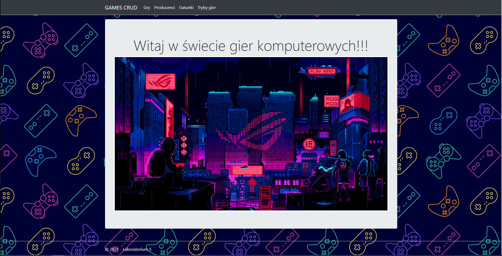
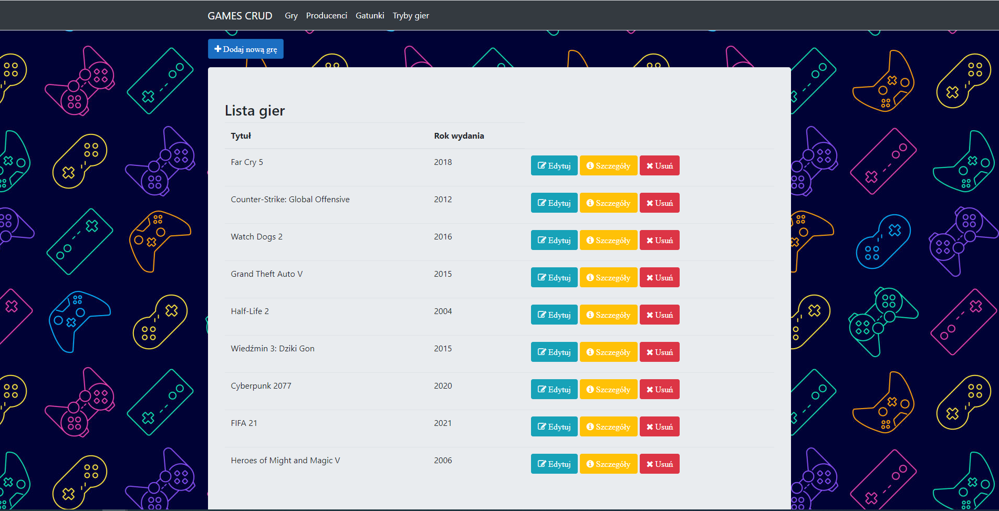
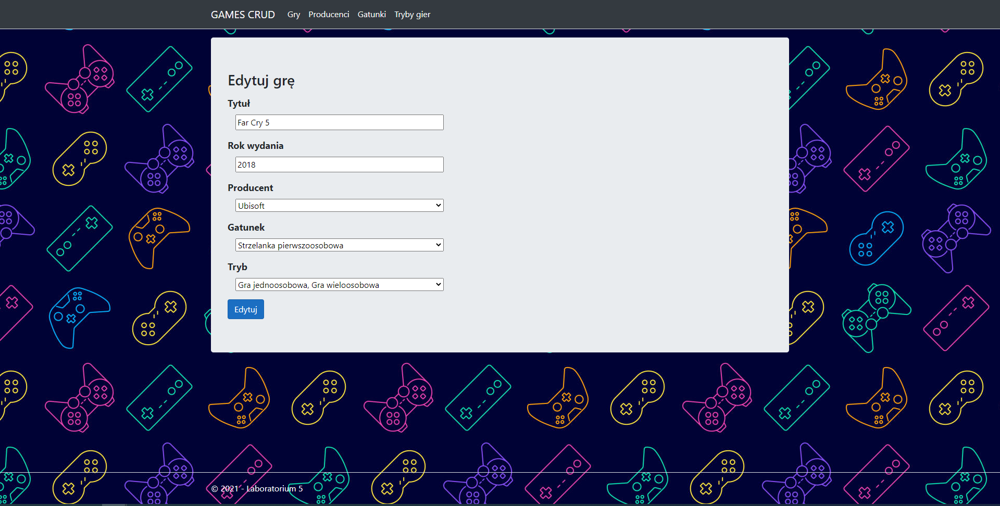

# GAMES CRUD - ASP.NET Core MVC

## Table of Contents
* [General Information](#general-information)
* [Technologies Used](#technologies-used)
* [Screenshots](#screenshots)
* [Setup](#setup)

## General Information

The project has been created in order to practise and consolidate material concerning basics of creation of applications in ASP.NET Core MVC in combination with Entity Framework.
The program enbables CRUD (create, read, update, delete) operations for computer games. Additionally, the computer games are stored in database by using Entity Framework.

## Technologies used
- C#
- ASP.NET Core MVC (.NET 5.0)
- Entity Framework
- Mircrosoft SQL Server 2019

## Screenshots

  
  
  

# Setup
- git clone [repository] or download ZIP and unzip this file
- open the project in Visual Studio
- press F5 on keyboard to run a program