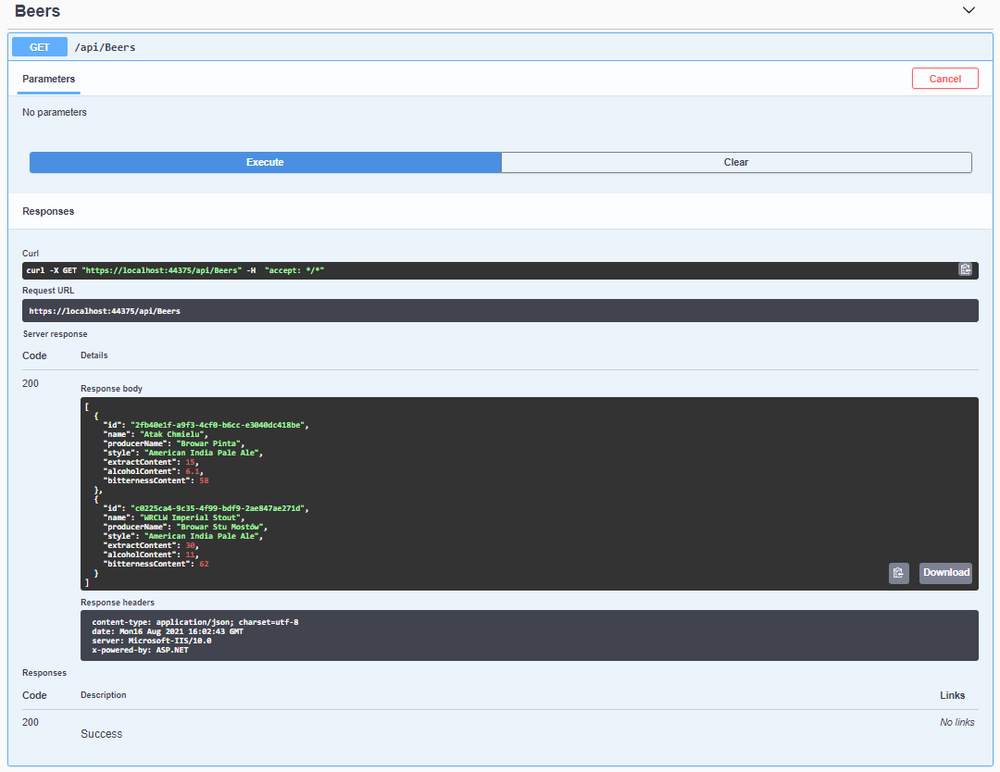
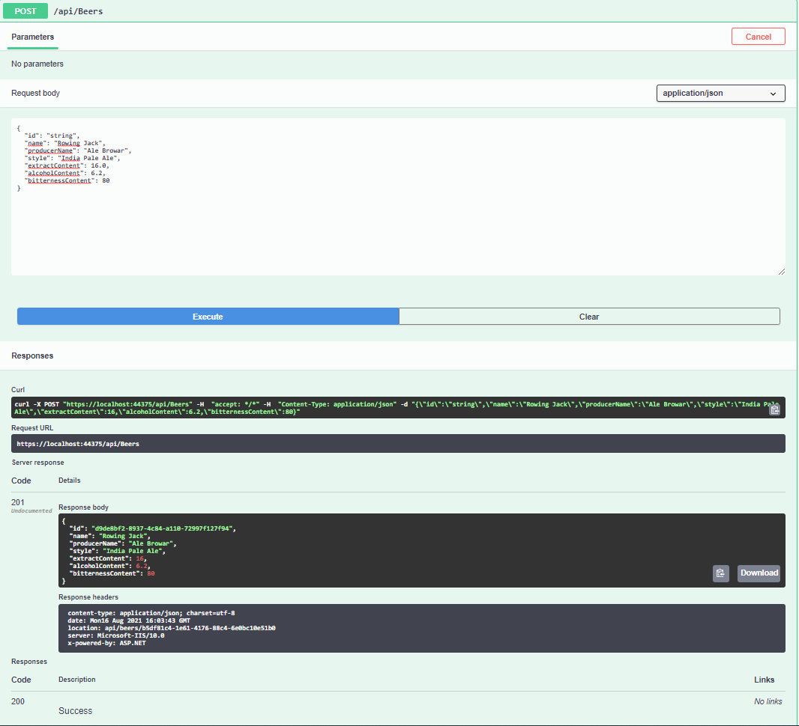
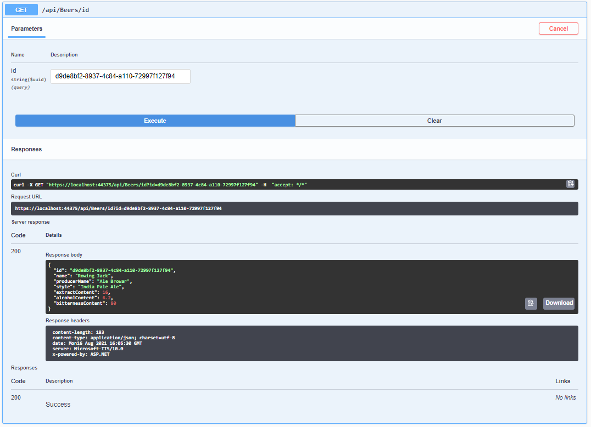
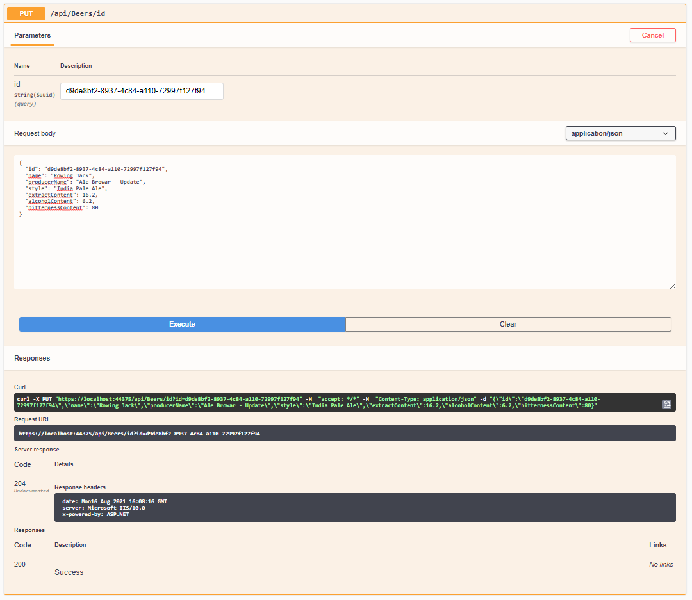
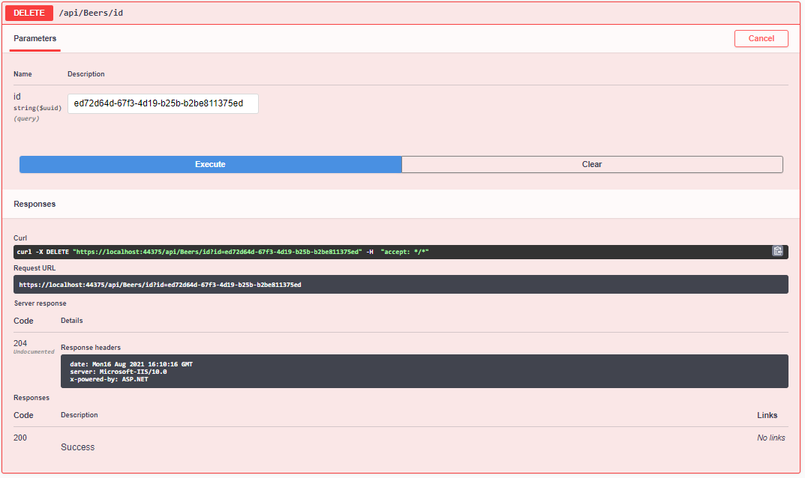

# ASP.NET CORE Web API - Beers/Wines

## Table of Contents
* [General Information](#general-information)
* [Technologies Used](#technologies-used)
* [Screenshots](#screenshots)
* [Setup](#setup)

## General Information
The purpose of the project was to create a Web Application Programming Interface (Web API) which enables basic operations such as create, read, update, delete (CRUD). The application has been created according to RESTful principles. Additonally, Swagger user interface has been used in order to visualize API resources and test created methods in terms of correct working.

The program has been created in order to get familiar with creation of WEB API as a part of programming course. The requirements which had to be met for the project:
- creation of at least two controllers,
- creation of the operations such as GET, POST, PUT, DELETE in each controller,
- each action should return appropriate HTTP responses,
- the application should have two layers (controllers and services) minimally,
- use of Dependency Injection,
- use of AutoMapper (object-to-object mapping library),
- use of Data Transfer Objects (DTOs),
- use of Swagger UI.

## Technologies used
- C#
- ASP.NET Core Web API (.NET 5.0)
- Swagger

## Screenshots
<h3>Available methods in Web API: </h3>

<ul>
	<li> <h3> GET (ALL) </h3> </li>
  	
    	<li> <h3> PUT </h3> </li>
  	
    	<li> <h3> GET (SPECIFIC ID) </h3> </li>
  	
	<li> <h3> POST </h3> </li>
  	
	<li> <h3> DELETE </h3> </li>
  	
</ul>

# Setup
- git clone [repository] or download ZIP and unzip this file
- open the project in Visual Studio
- press F5 on keyboard to run a program