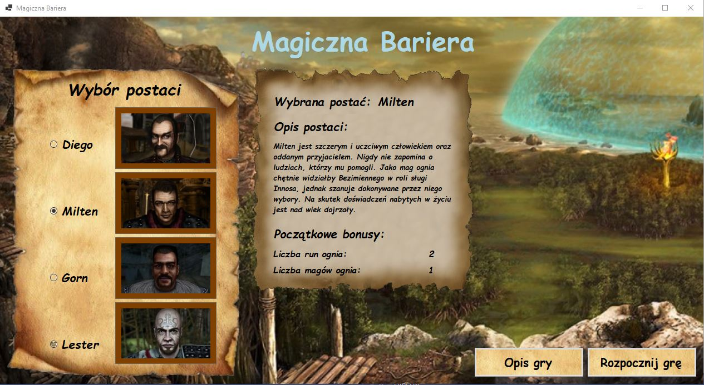
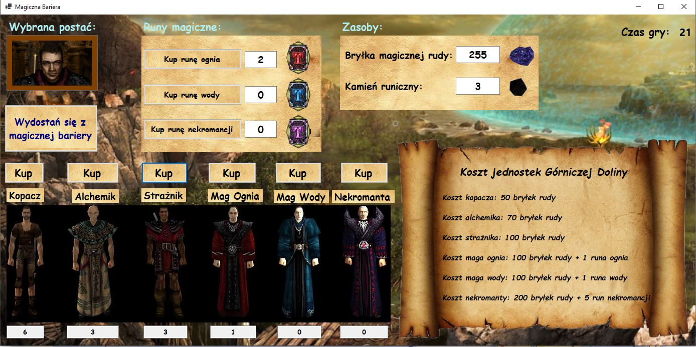
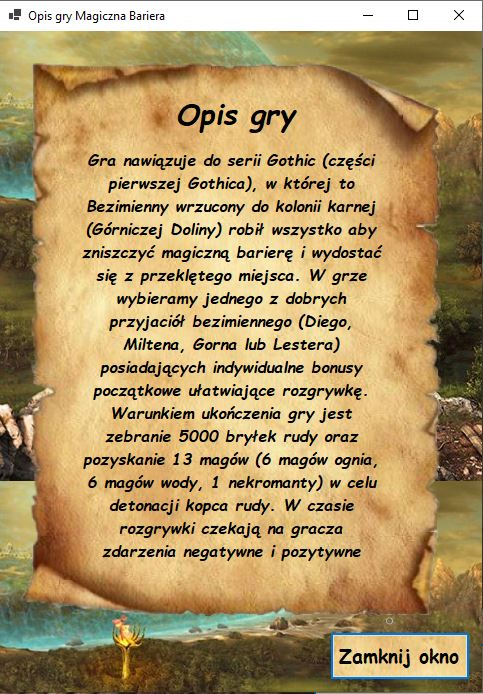

# Magic Barrier - Gothic game/simulator

## Table of Contents
* [General Information](#general-information)
* [Technologies Used](#technologies-used)
* [Screenshots](#screenshots)
* [Setup](#setup)

## General Information
The purpose of the project was to create a game or a simulator which enables a change of resources or units depending on time and occuring events during application runtime.
The program has been created in order to practise and consolidate material concerning basics of programming in C# as well as Windows Forms technology as a part of programming
course.

The application refers to iconic Gothic game (first part of Gothic), where the main character (unnamed prisoner) has been thrown inside the mining colony. Conesquently, he does everything at all costs to damage a magic barrier and get out of this place. 

User can select one of 4 friends of the main character who have got individual, initial bonuses. It is necessary to gather 5000 magical ore nuggets and recruit 13 magicians (6 fire magicians, 6 water magicians, 1 necromancer) in order to detonate an ore mound and win a game. 
Additionally, positive and negative events occur during the game. They depend on time and current state of units.

## Technologies used
- C#
- Windows Forms (.NET 5.0)

## Screenshots

  
  
  

# Setup
- git clone [repository] or download ZIP and unzip this file
- open the project in Visual Studio
- press F5 on keyboard to run a program