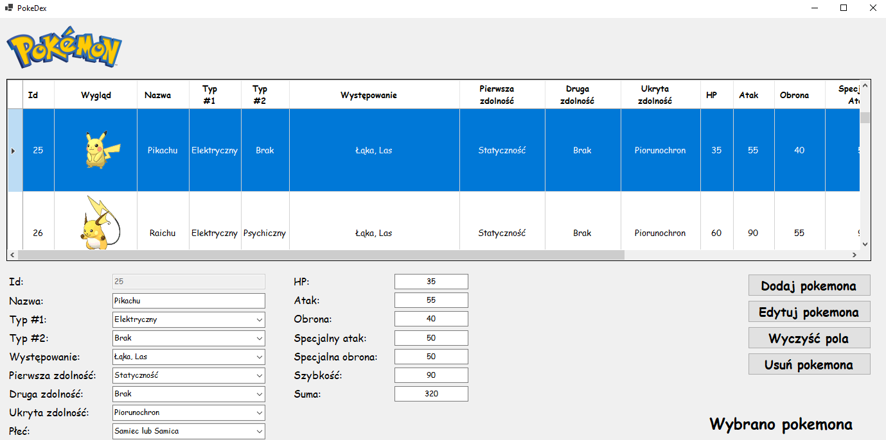
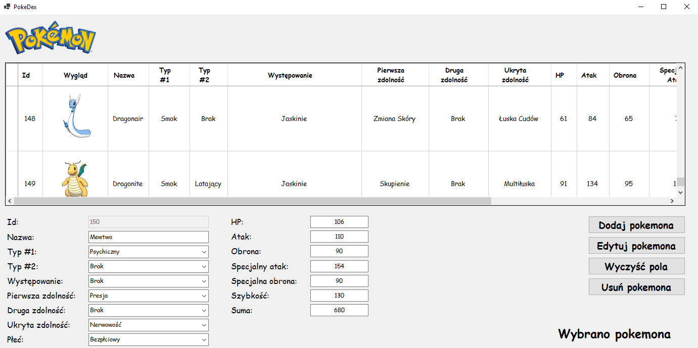

# Pokemons - Windows Forms application + SQL

## Table of Contents
* [General Information](#general-information)
* [Technologies Used](#technologies-used)
* [Screenshots](#screenshots)
* [Setup](#setup)

## General Information
The program enables CRUD (create, read, update, delete) operations for Pokemons. The Windows Forms application has been integrated with database. The program has been created in order to practise and consolidate material concerning basics of Windows Forms technology in combination with SQL.

## Technologies used
- C#
- Windows Forms (.NET 5.0)
- Microsoft SQL Server 2019

## Screenshots

  
  

# Setup
- git clone [repository] or download ZIP and unzip this file
- open the project in Visual Studio
- press F5 on keyboard to run a program